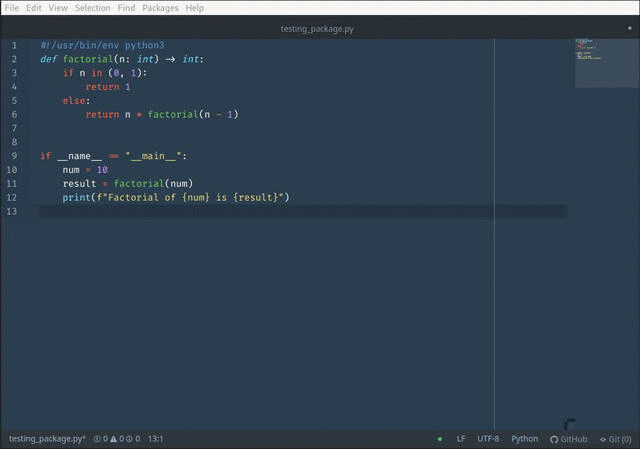

# python-docs package

Insert a basic function docstring template on .py files with Ctrl+Alt+D

## Install

apm install python-docs

## License
Copyright © 2019 [Javier Caballero](https://github.com/paxet).
This project is [MIT](LICENSE.md) licensed.
